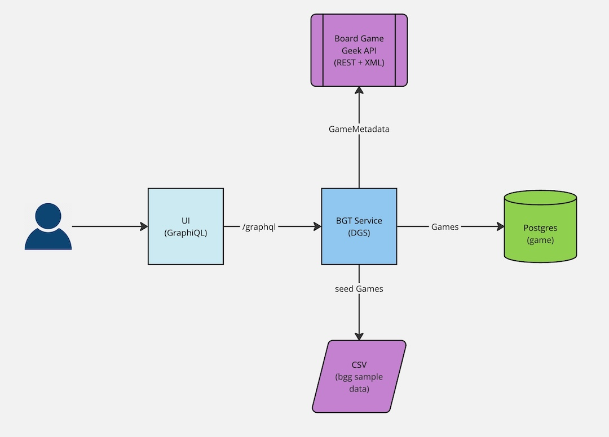

# bgt-service

This project is a graphql service for tracking information about board games and user board game collections. Currently only games are tracked and just a minimal set of fields to demonstrate the the app capabilities. 

This service will aggregate data for a board game stored locally by this service with enrichment from the [Board Game Geek (BGG) REST api](https://boardgamegeek.com/wiki/page/BGG_XML_API2).

## Architecture
The application architecture is very simple.  The service starts with a Graphiql front end providing the graph client a user can submit queries and mutations to.  
The user can use the `seed()` mutation to seed the database with sample data from a csv file.  
When `metadata` is requested, a dataloader will aggregate that portion of the graph using data from the public Board Game Geek REST Api.
The service uses `Postgres` as a data store.



## Future Enhancements

The app could be expanded in a number of ways by adding more user value
- Add filtering and sorting to `queryGames()`
- Track additional fields for games (type, genre, publish date, etc)
  - Can add additional fields not available on BGG or just additional fields for indexing purposes
  - Can enrich games with more fields form the BGG API
- Add user collections
  - Integrate user collections with Board Game Geek Collections

The app could be improved in a few ways as well that don't directly add new end-user features
- Break Games, GameMetadata, and Collections into separate DGS and federate with [Apollo](https://www.apollographql.com/docs/graphos/schema-design/federated-schemas/federation)
- Add security and RBAC
- Add multitenancy
- Better resiliency with calling the BGG service.  
  - Better error handling
  - retries on failure 
  - circuit breaker

# Running Tests

The tests in this project use testcontainers so ensure you have a local docker daemon running and the tests should run out-of-the-box.
```bash
./gradlew clean test
```

## Running the Application Locally
Running this application locally expects a postgres DB to be running on port 5432 with a DB named 'bgt'.  You can spin one up in docker as follows:
```bash
docker run -d --name bgt -p 5432:5432 -e ALLOW_EMPTY_PASSWORD=yes -e POSTGRESQL_DATABASE=bgt bitnami/postgresql:latest
```

The easiest way to run the app is from the command line.  The local profile will default to port 8080.  You can change the profile's `server.port` to 0 if you prefer a random available port.
```bash
./gradlew bootRun --args='--spring.profiles.active=local'
```

The GraphQL playground will be available on: http://localhost:8080/graphiql

If you'd like to seed the database with some data from BGG, I have included a CSV containing the top 1000 ranked board games from BGG.  You can seed the DB by running the following GraphQL mutation from graphiql.  Just replace the value of project root with the path to you local repo.

```graphql
mutation seed {
  seedGames(filename: "<project root>/boardgames-top1000.csv") {
    id
    name
  }
}
```

## Querying Games

You can query games with a query like this:
```graphql
query {
    queryGames {
        games {
            id
            bggId
            name
        }
    }
}
```

When 'metadata' is requested, the metadata is actually aggregated from the BGG REST Api and returned in this single graphql api:
```graphql
query {
    queryGames {
        games {
            id
            bggId
            name
            metadata {
                description
            }
        }
    }
}
```

## Creating Games

You can create games with the following mutation.  The id of the bgg game is optional, but required if you want to enrich metadata.
```graphql
mutation {
    createGame(input: {bggId: 1234 name: "My new game"}) {
        id
        bggId
        name
    }
}
```